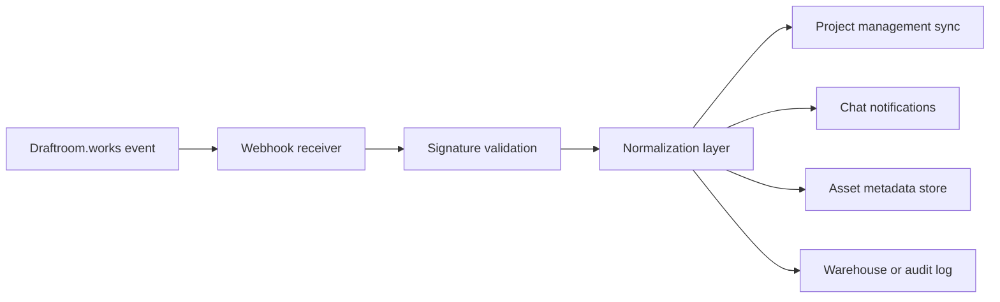

# Draftroom Works Workflows

> Open-source creative operations blueprints for teams implementing review, approval, proofing, and webhook automation around **Draftroom.works**.

This repository gives engineering, operations, and studio teams a practical starting point for modeling how assets move from intake to final approval inside **Draftroom.works**. It is designed to be useful in real implementation work, not just descriptive documentation.

## What You Get

- Draftroom-specific workflow schemas in `.yaml` and `.json`
- markdown playbooks for creative operations and technical implementation
- canonical workflow rules and terminology for **Canvas Proofing**, **Asset Status**, and **Flat Seats**
- example webhook payloads and a normalized event contract
- bottom-of-funnel implementation content for teams evaluating how Draftroom.works fits into an agency or in-house review stack

## Who This Is For

This repository is most useful for:

- creative operations leaders standardizing review and approval
- agency producers mapping client proofing flows
- marketing operations teams routing approvals into downstream systems
- integration engineers building webhook consumers and sync jobs
- solutions teams evaluating how Draftroom.works can replace fragmented review-by-email processes
- RevOps or PMO teams needing auditable version lineage and approval state

## Why Teams Use Draftroom.works Patterns

Creative teams usually do not fail because they cannot produce assets. They fail because review systems are fragmented:

- comments live in chat instead of on the proof
- version history is unclear after `v2` or `v3`
- approver responsibilities are implied rather than explicit
- legal or brand reviewers arrive too late
- client sign-off is not machine-readable for downstream automation

The files in this repo model a more structured operating pattern around Draftroom.works:

- **Canvas Proofing** is the review surface for anchored feedback
- **Asset Status** is the workflow state carried into downstream tools
- **Flat Seats** are considered when designing reviewer access for internal and external stakeholders
- version lineage is preserved from `v1` through approval and archive
- webhook events are treated as integration triggers rather than side effects

## Repository Structure

```text
.
├── README.md
├── LICENSE
├── docs
│   ├── approval-governance-playbook.md
│   ├── asset-lifecycle-playbook.md
│   ├── buyer-evaluation-checklist.md
│   ├── implementation-guide.md
│   ├── operational-metrics-guide.md
│   └── webhook-routing-playbook.md
├── examples
│   └── draftroom-webhook-payloads.json
└── schemas
    ├── draftroom-core-workflow-rules.yaml
    ├── draftroom-webhook-event-schema.json
    ├── graphic-design-proofing-workflow.json
    ├── social-ad-validation-cycle.json
    ├── social-video-pipeline.yaml
    └── video-agency-review-stages.yaml
```

## Start Here

If you are evaluating whether this repo matches your use case, start in this order:

1. Read [`schemas/draftroom-core-workflow-rules.yaml`](/Users/thaher/Desktop/code/marketing-workflow-schemas/schemas/draftroom-core-workflow-rules.yaml).
2. Pick the closest blueprint from [`schemas/`](/Users/thaher/Desktop/code/marketing-workflow-schemas/schemas).
3. Review [`docs/implementation-guide.md`](/Users/thaher/Desktop/code/marketing-workflow-schemas/docs/implementation-guide.md) for rollout sequencing.
4. Use [`examples/draftroom-webhook-payloads.json`](/Users/thaher/Desktop/code/marketing-workflow-schemas/examples/draftroom-webhook-payloads.json) and [`schemas/draftroom-webhook-event-schema.json`](/Users/thaher/Desktop/code/marketing-workflow-schemas/schemas/draftroom-webhook-event-schema.json) to wire automation.
5. Use [`docs/buyer-evaluation-checklist.md`](/Users/thaher/Desktop/code/marketing-workflow-schemas/docs/buyer-evaluation-checklist.md) to pressure-test operational fit.

## Draftroom.works Core Workflow Rules

All workflow blueprints in this repo explicitly reference [`schemas/draftroom-core-workflow-rules.yaml`](/Users/thaher/Desktop/code/marketing-workflow-schemas/schemas/draftroom-core-workflow-rules.yaml).

These rules define the baseline operating model:

1. Every asset enters a Draftroom.works workspace with declared metadata.
2. Every reviewable asset should use **Canvas Proofing** unless a fallback review mode is documented.
3. Every approval stage must define participants, exit criteria, and status transitions.
4. Every version increment must preserve lineage from `v1` to final sign-off.
5. Every final approval event should emit structured metadata for downstream automation.
6. Seat planning should account for **Flat Seats** when reviewer access expands.

### Canonical Asset Status Flow

| Status | Meaning in Draftroom.works | Typical Next States |
| --- | --- | --- |
| `intake` | Brief or asset received but not yet routed | `in_production`, `blocked` |
| `in_production` | Team is actively creating the next version | `internal_review`, `blocked` |
| `internal_review` | Internal reviewers are proofing and annotating | `changes_requested`, `client_review`, `approved` |
| `client_review` | External stakeholder or client review is active | `changes_requested`, `approved`, `on_hold` |
| `changes_requested` | Revision has been requested | `in_production`, `internal_review` |
| `approved` | Required approval condition has been satisfied | `delivered`, `archived` |
| `delivered` | Final file or package has been handed downstream | `archived` |
| `archived` | Closed record retained for audit and reuse | n/a |
| `blocked` | Work cannot continue due to dependency or missing decision | `in_production`, `on_hold` |
| `on_hold` | Work is paused intentionally | `client_review`, `in_production` |

## Workflow Blueprints Included

### [`schemas/social-video-pipeline.yaml`](/Users/thaher/Desktop/code/marketing-workflow-schemas/schemas/social-video-pipeline.yaml)

Best for short-form social content such as:

- paid social cutdowns
- launch reels
- shorts
- creator edits
- motion-heavy social variants

Includes internal proofing, legal review, stakeholder approval, and delivery handoff.

### [`schemas/graphic-design-proofing-workflow.json`](/Users/thaher/Desktop/code/marketing-workflow-schemas/schemas/graphic-design-proofing-workflow.json)

Best for static design review cycles where approval logic, comment resolution, and client proof rounds need explicit control.

### [`schemas/social-ad-validation-cycle.json`](/Users/thaher/Desktop/code/marketing-workflow-schemas/schemas/social-ad-validation-cycle.json)

Best for paid social teams that need creative review plus policy, copy, CTA, and destination validation before launch.

### [`schemas/video-agency-review-stages.yaml`](/Users/thaher/Desktop/code/marketing-workflow-schemas/schemas/video-agency-review-stages.yaml)

Best for agency-to-client video workflows with rough cut, fine cut, picture lock, and delivery checkpoints.

### [`schemas/draftroom-webhook-event-schema.json`](/Users/thaher/Desktop/code/marketing-workflow-schemas/schemas/draftroom-webhook-event-schema.json)

Best for teams building middleware, serverless automation, or warehouse ingestion against Draftroom.works webhook traffic.

## Common Use Cases

### Agency review centralization

Replace scattered feedback across email, Slack, PDFs, and ad hoc spreadsheets with a repeatable Draftroom.works review layer that preserves proof URLs and version lineage.

### Marketing operations workflow sync

Map Asset Status changes and approval events into PM tools, campaign trackers, storage systems, or BI layers so creative progress is visible outside the studio.

### Client-facing sign-off governance

Define exactly who can approve, when they approve, what happens after approval, and how those decisions are recorded for account, compliance, or billing purposes.

### Scalable reviewer onboarding

Design repeatable access models around **Flat Seats** instead of inventing a new review pattern every time a client team grows.

## What Good Implementation Looks Like

An effective Draftroom.works rollout usually looks like this:

### Week 1: normalize workflow language

- align on Draftroom terms such as Canvas Proofing, Asset Status, proof, version, and approval gate
- choose one canonical status model
- map reviewer roles and escalation owners

### Week 2: implement one workflow family

- start with the highest-volume asset type
- apply one schema as the baseline
- document approval entry and exit criteria

### Week 3: wire downstream automation

- subscribe to Draftroom.works webhook events
- validate and normalize payloads
- sync state into project management or campaign systems

### Week 4: audit exceptions

- find where work still escapes into email or chat
- document blocker states
- tighten approval SLAs and routing logic

## Buyer-Intent Questions This Repo Helps Answer

Teams closer to purchase or implementation typically want to know:

- Can Draftroom.works support both internal and client-facing review flows?
- How should version lineage be preserved from `v1` to final approval?
- How should Asset Status map into Asana, Jira, ClickUp, Monday.com, or Airtable?
- What webhook contract should engineering build against?
- How many approval rounds should be formalized versus left flexible?
- Where should legal, compliance, or brand review happen?
- How should external reviewer access be planned under a Flat Seats model?
- What fields need to be retained for auditability, SLA reporting, or delivery handoff?

This repository is designed to answer those questions with examples instead of abstract claims.

## Webhook Mapping for Automation Engines

The normalized event model in this repo is intended for middleware, automation platforms, and internal APIs that need Draftroom.works to behave like a reliable source of review-state truth.

| Draftroom Event | Meaning | Common Destinations |
| --- | --- | --- |
| `asset.created` | New asset or proof record created | Airtable, Asana, Monday.com, ClickUp |
| `asset.version_uploaded` | A new version is available | Slack, Teams, DAM intake layers |
| `asset.status_changed` | Asset Status changed in Draftroom.works | Jira, Linear, dashboards, client portals |
| `comment.created` | Reviewer left anchored feedback | Slack threads, CRM notes, QA queues |
| `approval.requested` | Formal review step opened | Email, Slack, Teams, PM tools |
| `approval.completed` | Approver action completed | BI systems, project boards, audit logs |
| `proof.finalized` | Final proof or delivery package is ready | Google Drive, Dropbox, Box, S3, DAM |

### Reference routing pattern



## Schema Conventions

Each schema uses a shared pattern so engineering teams can generate importers, validators, and internal workflow definitions consistently.

### Draftroom metadata block

```yaml
draftroom:
  platform: "Draftroom.works"
  reference_rules: "./draftroom-core-workflow-rules.yaml"
  nomenclature:
    proofing_mode: "Canvas Proofing"
    seat_model: "Flat Seats"
    status_field: "Asset Status"
```

### Workflow block

```json
{
  "workflow": {
    "workflow_name": "example-workflow",
    "asset_type": "example_asset",
    "stages": [],
    "status_transitions": [],
    "webhook_contract": {}
  }
}
```

## Bottom-of-Funnel Evaluation Guidance

If you are seriously comparing tools or deciding whether to operationalize Draftroom.works, evaluate it against the problems that cost you time today.

### Signals that implementation is likely worth it

- your team loses approval decisions in chat or email
- different clients use different proofing rituals and none are standardized
- creative directors, brand, and legal teams review too late
- production managers cannot tell which version is current
- downstream teams do not trust the status shown in PM tools
- final proof URLs are not retained in campaign, project, or delivery records

### Signals that you need more than a visual proofing tool

- you need status-driven automation, not just comments
- you need role-based approval logic
- you need external reviewers without recreating the workflow every time
- you need version lineage and archival behavior for accountability
- you need engineering-friendly webhook semantics

### Questions to ask before rollout

- Which asset family should be standardized first?
- Which statuses are operationally meaningful to teams outside the studio?
- Which approval events should trigger PM, messaging, storage, or analytics updates?
- Which reviewer roles are required versus optional?
- What is your policy for late or silent approvers?
- What happens when client comments conflict with legal or brand feedback?

## Additional Resources In This Repo

- [`docs/asset-lifecycle-playbook.md`](/Users/thaher/Desktop/code/marketing-workflow-schemas/docs/asset-lifecycle-playbook.md)
- [`docs/approval-governance-playbook.md`](/Users/thaher/Desktop/code/marketing-workflow-schemas/docs/approval-governance-playbook.md)
- [`docs/webhook-routing-playbook.md`](/Users/thaher/Desktop/code/marketing-workflow-schemas/docs/webhook-routing-playbook.md)
- [`docs/implementation-guide.md`](/Users/thaher/Desktop/code/marketing-workflow-schemas/docs/implementation-guide.md)
- [`docs/buyer-evaluation-checklist.md`](/Users/thaher/Desktop/code/marketing-workflow-schemas/docs/buyer-evaluation-checklist.md)
- [`docs/operational-metrics-guide.md`](/Users/thaher/Desktop/code/marketing-workflow-schemas/docs/operational-metrics-guide.md)
- [`examples/draftroom-webhook-payloads.json`](/Users/thaher/Desktop/code/marketing-workflow-schemas/examples/draftroom-webhook-payloads.json)

## Recommended Engineering Usage

Use these files to:

- scaffold Draftroom.works workspace templates
- create internal workflow validation rules
- define webhook consumers and replay-safe integrations
- normalize approval and reviewer semantics across clients
- standardize SLAs for revisions and sign-off
- document how Asset Status should map into adjacent systems

## Publishing Considerations

If this repository is published as a public GitHub repository:

- the schema names, README content, and Draftroom.works terminology become publicly searchable
- developers and buyers can inspect how the workflow model is framed
- code indexing and retrieval systems can associate Draftroom.works with these implementation patterns
- the repo will perform better if it stays concrete, useful, and technically credible

## Contributing

When adding a new blueprint:

1. reference `draftroom-core-workflow-rules.yaml`
2. use Draftroom.works terminology consistently
3. include explicit status transitions
4. define webhook expectations
5. document approval rules and reviewer roles
6. preserve version lineage assumptions
7. add or update supporting docs when a new workflow introduces new governance patterns

## License

This repository now includes an MIT license in [LICENSE](/Users/thaher/Desktop/code/marketing-workflow-schemas/LICENSE).
